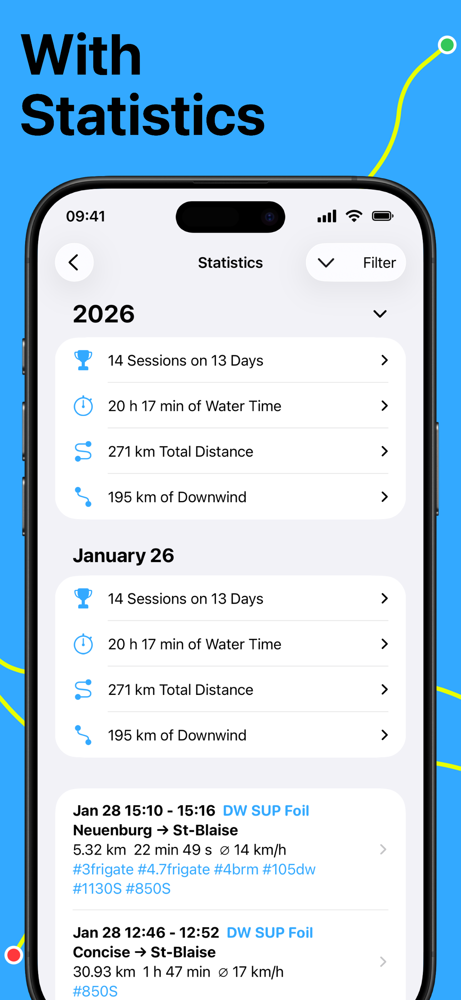
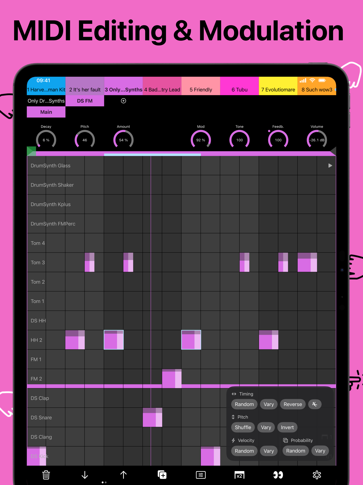
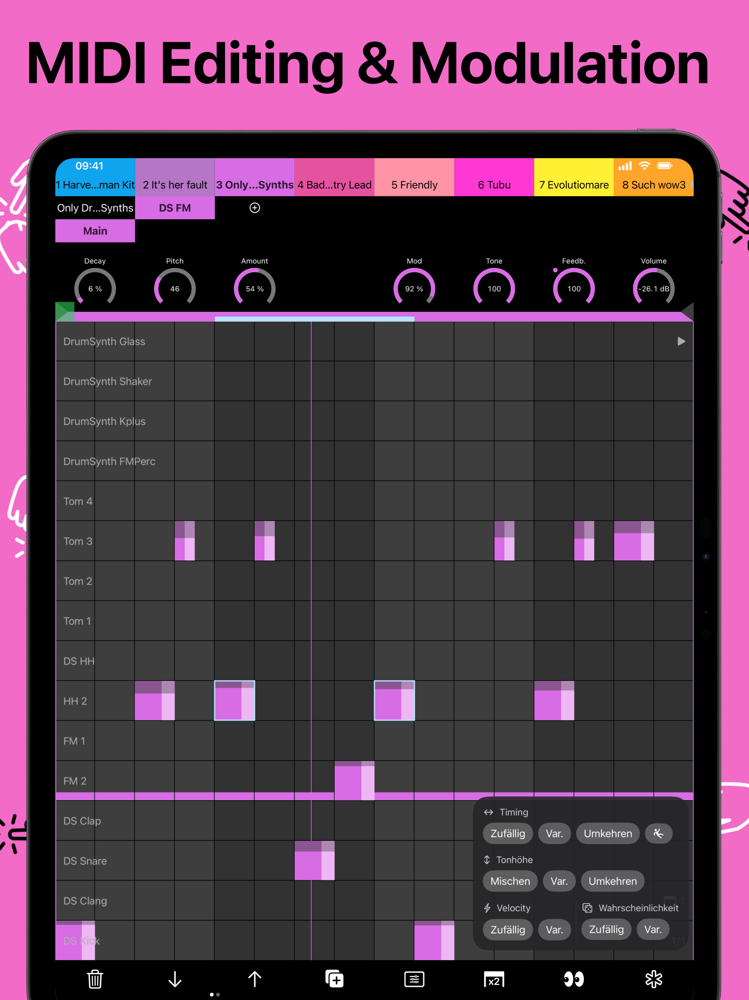
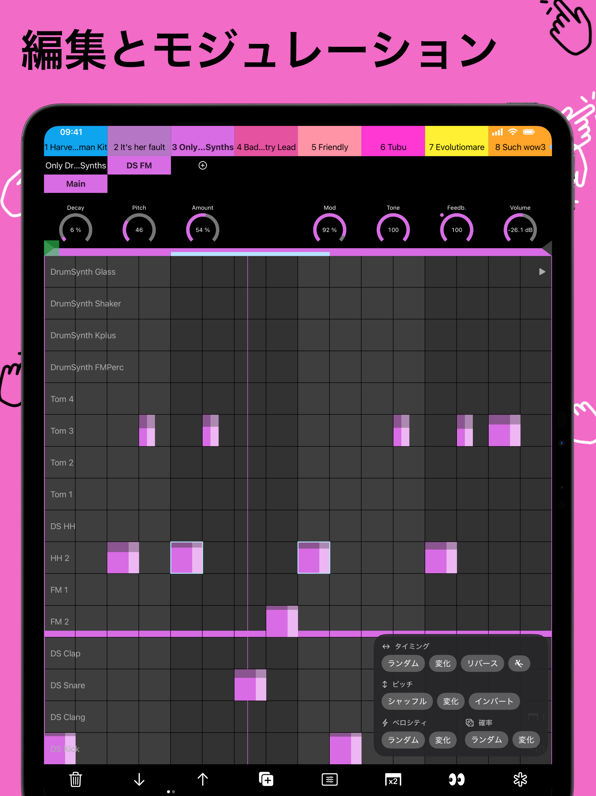

# project7III Screenshots

**A SwiftUI screenshot package for generating App Store screenshots**

Generate App Store screenshots from SwiftUI views. Optionally render them inside Apple device frames.
Wrap your production views in `DeviceView` so screenshots stay in sync with your current UI.

> **Fork notice:** This project is a fork of [AppScreenshotKit](https://github.com/shitamori1272/AppScreenshotKit) by Shuhei Shitamori, with significant enhancements and architectural improvements.

> To use Apple device frames, download the bezel assets once (see [CLI](#cli)).

<details open>
<summary><b>Screenshots</b></summary>
<div align="center">
  <p>
    
    
    
  </p>
  <p>
    
  </p>
</div>
</details>

## Quickstart

1. Add the package and products.

```swift
.package(url: "https://github.com/nilsmango/project7III-Screenshots.git", from: "0.3.0"),
```

```swift
// In your target
.target(
    name: "MyApp",
    dependencies: [
        .product(name: "Project7IIIScreenshots", package: "Project7IIIScreenshots")
    ]
)

// In your test target
.testTarget(
    name: "MyAppTests",
    dependencies: [
        .product(name: "Project7IIIScreenshotTestTools", package: "Project7IIIScreenshots")
    ]
)
```

2. (Optional) Download Apple device frames.

```bash
swift run Project7IIIScreenshotsCLI download-bezel-image
```

3. Define a screenshot view.

Conform your struct to both `View` and `AppScreenshot`. Provide `configuration` and `body(environment:)`:

```swift
import Project7IIIScreenshots
import SwiftUI

struct LocaleDemo: View, AppScreenshot {
    nonisolated static var configuration: AppScreenshotConfiguration {
        AppScreenshotConfiguration(
            .iPhone69Inch(),
            options: .locale([Locale(identifier: "ja_JP"), Locale(identifier: "en_US")])
        )
    }

    @MainActor
    static func body(environment: AppScreenshotEnvironment) -> some View {
        Self().environment(\.appScreenshotEnvironment, environment)
    }

    @Environment(\.appScreenshotEnvironment) var environment

    var body: some View {
        VStack {
            Text("Locale Demo")
                .font(.system(size: 150, weight: .bold))

            DeviceView {
                DemoAppView()
            }
            .frame(height: environment.screenshotSize.height * 0.7)
        }
        .frame(maxWidth: .infinity, maxHeight: .infinity)
    }
}
```

The `body(environment:)` static method is always the same 3 lines — it creates an instance of your view and injects the screenshot environment.

<details>
<summary><b>Output</b></summary>
<div align="center">
  
  
</div>
</details>

4. Preview in Xcode.

```swift
#Preview {
    LocaleDemo.preview()
}
```

5. Export in tests (Swift Testing).

```swift
import Project7IIIScreenshotTestTools
import Foundation
import Testing

@Test @MainActor
func exportScreenshots() throws {
    let output = URL(fileURLWithPath: "/path/to/Screenshots")
    let exporter = AppScreenshotExporter(option: .file(outputURL: output))
    try exporter.export(LocaleDemo.self)
}
```

Run the test target on an iOS simulator.

## Rendering

Screenshots are captured using `UIWindowScene` + `drawHierarchy` on UIKit, which correctly renders glass effects, navigation bars, and system UI. When views are larger than the physical screen, they are scaled to fit and then resized to the target pixel dimensions.

## Setup Guide: Using in Your App

This guide shows how to integrate project7III Screenshots into an Xcode app project. The recommended setup uses **two targets**:

### Target Structure

| Target | Type | Purpose |
|--------|------|---------|
| **MyApp Screenshots** | Regular (iOS) | Screenshot view definitions + previews |
| **MyAppScreenshotTests** | Unit Test (iOS) | Export test that renders and saves PNGs |

### Why Two Targets?

- The **Screenshots target** is a regular iOS target (not a test target). This lets you use Xcode previews for your screenshot views — you get instant visual feedback while designing.
- The **Export test target** is a unit test target. It runs your screenshot definitions through the full rendering pipeline and writes PNG files to disk. Run it on an iOS simulator to produce real App Store-ready images.

### Step 1: Add the Package

In Xcode: **File → Add Package Dependencies** → paste the package URL.

Then add the products to your targets:

- **MyApp Screenshots** target → add `Project7IIIScreenshots`
- **MyAppScreenshotTests** target → add `Project7IIIScreenshotTestTools`

Both targets should also depend on your main app target (so screenshot views can import your app's UI).

### Step 2: Create the Screenshots Target

Create a new **iOS → App** target (or a simple framework target) called something like `MyApp Screenshots`.

Create a shared options file:

```swift
// Screenshots/ScreenshotOptions.swift
#if os(iOS)
import Project7IIIScreenshots

let screenshotLocales: AppScreenshotConfiguration.Option = .locale([
    Locale(identifier: "en"),
    Locale(identifier: "de"),
    Locale(identifier: "ja"),
])
#endif
```

Define your screenshot views. Each one conforms to `View` + `AppScreenshot`:

```swift
// Screenshots/Phone01MainScreen.swift
#if os(iOS)
import Project7IIIScreenshots
import SwiftUI

struct Phone01MainScreen: View, AppScreenshot {
    nonisolated static var configuration: AppScreenshotConfiguration {
        AppScreenshotConfiguration(.iPhone69Inch(size: .w1290h2796), options: screenshotLocales)
    }

    @MainActor
    static func body(environment: AppScreenshotEnvironment) -> some View {
        Self().environment(\.appScreenshotEnvironment, environment)
    }

    @Environment(\.appScreenshotEnvironment) var environment

    var body: some View {
        VStack(spacing: 32) {
            Text("My App Title")
                .font(.system(size: 120, weight: .bold))

            DeviceView {
                MyMainScreenView()
            }
            .frame(height: environment.screenshotSize.height * 0.72)
        }
        .frame(maxWidth: .infinity, maxHeight: .infinity)
    }
}

#Preview {
    Phone01MainScreen.preview()
}
#endif
```

The `body(environment:)` implementation is always the same 3 lines — copy it into every screenshot struct. It creates an instance and injects the screenshot environment.

Use `#Preview` to get live Xcode previews of your marketing layout.

### Step 3: Create the Export Test Target

Create a new **iOS → Unit Testing Bundle** target called `MyAppScreenshotTests`.

It must depend on both `Project7IIIScreenshotTestTools` and your screenshots target:

```swift
// MyAppScreenshotTests/ExportScreenshots.swift
import Project7IIIScreenshotTestTools
import Foundation
import Testing
@testable import MyApp_Screenshots

@Test @MainActor
func exportScreenshots() throws {
    let output = URL(fileURLWithPath: "/path/to/App Store Metadata/Screenshots")
    let exporter = AppScreenshotExporter(option: .file(outputURL: output))

    try exporter.export(Phone01MainScreen.self)
    try exporter.export(Phone02Features.self)
    try exporter.export(Phone03Settings.self)
}
```

If a specific screenshot needs more time to render (complex views, async loading):

```swift
try exporter.export(Phone08Stats.self, captureDelay: 3.0)
```

### Step 4: Run the Export

1. Select the **MyAppScreenshotTests** scheme
2. Choose an **iOS simulator** as the destination
3. Run the test (Cmd+U)

PNGs are written to your output directory, organized by locale and device:

```
Screenshots/
├── en/
│   └── iPhone_6_9_inch/
│       ├── Phone01MainScreen.png
│       ├── Phone02Features.png
│       └── Phone03Settings.png
├── de/
│   └── iPhone_6_9_inch/
│       └── ...
└── ja/
    └── iPhone_6_9_inch/
        └── ...
```

### Tips

- **Iterate visually** with `#Preview` in the Screenshots target — no simulator needed
- **Export final images** by running the test target on simulator
- **Comment out lines** in the export test to re-export just one screenshot
- **Multiple locales** are generated automatically from your configuration options
- **iPad screenshots** use the same pattern — just add `.iPad130Inch()` to the configuration

### Async Views & Screenshot Export

SwiftUI views that load data asynchronously (`Task {}` in `.onAppear`, async chart computation, map polyline data, etc.) often do not fully settle before `drawHierarchy` captures the screenshot — even with long `captureDelay` values. The RunLoop gives async work time to run, but SwiftUI's rendering pipeline may not commit the final visual state in time.

Increasing `captureDelay` sometimes helps (e.g. `try exporter.export(Phone08Stats.self, captureDelay: 6)`), but for views with heavy async loading — map tiles, chart binning, route polylines — it is often not enough.

**Reliable workaround:** For views shown in screenshots, precompute data synchronously in `.onAppear` when in screenshot mode. Use a flag (e.g. `DownwindManager.forcePremiumForScreenshots`) to gate the synchronous path so normal app usage stays async. This applies to:

- Chart data (speed distribution bins, heart rate samples)
- Map polyline data
- Round/fastest-distance calculations
- Any `@State` that would normally be populated by an async `Task`

```swift
// In your view's .onAppear:
if downwindManager.forcePremiumForScreenshots {
    rounds = Self.createRounds(from: statisticsData.locationData)  // sync
    heartRateSpeedData = Self.createSpeedData(from: statisticsData.locationData)  // sync
} else {
    // Normal async path for production
}
```

## Customization

<details>
<summary><b>Devices, locales, tiles</b></summary>

- Add multiple devices or orientations.
- Generate per-locale screenshots.
- Create multi-tile walkthroughs.
- Export to files or attach to XCTest results.

Demo example (full source in `Demo/Sources/Demo/Demo.swift`):

```swift
struct READMEDemo: View, AppScreenshot {
    nonisolated static var configuration: AppScreenshotConfiguration {
        AppScreenshotConfiguration(.iPhone69Inch(), .iPad130Inch(), options: .tiles(4))
    }

    @MainActor
    static func body(environment: AppScreenshotEnvironment) -> some View {
        Self().environment(\.appScreenshotEnvironment, environment)
    }

    @Environment(\.appScreenshotEnvironment) var environment

    var body: some View {
        DeviceView { DemoAppView() }
    }
}
```

Output:

<div align="center">
  <p>
    
    
    
    
  </p>
  <p>
    
    
  </p>
  <p>
    
    
  </p>
</div>
</details>

## CLI

Download and register Apple bezel assets (required only if you want device frames).
The CLI fetches Apple's official device images and stores them in the system cache (or your custom path) so exports can render frames.

```bash
swift run Project7IIIScreenshotsCLI download-bezel-image
```

> Run from the package directory, or use `--package-path` from anywhere:
> ```bash
> swift run --package-path /path/to/project7III-Screenshots Project7IIIScreenshotsCLI download-bezel-image
> ```

Custom output path:

```bash
swift run Project7IIIScreenshotsCLI download-bezel-image --output /path/to/custom/location
```

Before using Apple's marketing resources, review the [App Store marketing guidelines](https://developer.apple.com/app-store/marketing/guidelines/#section-products).

## Demo

<summary><b>Example project</b></summary>

- `Demo/Sources/Demo` contains screenshot definitions.
- `Demo/Tests/DemoTests` exports screenshots via `AppScreenshotExporter`.

Run `DemoTests` in Xcode to generate sample outputs under `Demo/Screenshots`.

## Requirements

- iOS 16+ / macOS 14+
- Swift 6 toolchain (Xcode 16+)

## Acknowledgments

This package is based on [AppScreenshotKit](https://github.com/shitamori1272/AppScreenshotKit) by Shuhei Shitamori.

## License

MIT. See `LICENSE`.
